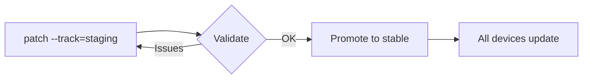

import { CodeTabs, LinkCard } from 'starlight-theme-nova/components';

**Tracks** are named deployment channels that control which devices receive a
patch. Every Shorebird app has a built-in `stable` track, which is the default
channel that all devices subscribe to. You can create additional tracks (such as
`staging` or `beta`) on the fly, simply by naming them when publishing a patch.
No configuration or registration is needed; tracks are created implicitly.

## How tracks work

When your app starts up, the Shorebird updater asks the server: _"Is there a new
patch on the **stable** track for this release version?"_ If you have integrated
`package:shorebird_code_push`, your app can instead ask for patches on a
different named track. This makes it possible to route specific devices (e.g.,
your QA team's phones) to a `beta` or `staging` patch without affecting
production users.



## Built-in vs. custom tracks

| Track      | Description                                                                                                 |
| ---------- | ----------------------------------------------------------------------------------------------------------- |
| `stable`   | The default track. All devices receive patches from this track unless they explicitly subscribe to another. |
| `staging`  | Convention for internal / CI validation before promoting to production.                                     |
| `beta`     | Convention for wider pre-production testing (e.g., QA teams, opt-in testers).                               |
| _Any name_ | Tracks are created on demand. Any string is a valid track name.                                             |

:::note

Track names are arbitrary strings. `staging` and `beta` are community
conventions, not reserved keywords. Use whatever naming convention makes sense
for your team.

:::

## Publishing a patch to a track

Pass the `--track` flag to any `shorebird patch` command. If you omit the flag,
the patch is published to `stable` by default.

<CodeTabs>

```bash title="Android"
shorebird patch android --track=staging
```

```bash title="iOS"
shorebird patch ios --track=staging
```

```bash title="macOS"
shorebird patch macos --track=staging
```

</CodeTabs>

You can use any custom track name:

```bash
shorebird patch android --track=beta
shorebird patch android --track=qa-team
```

## Previewing a patch on a specific track

Use `shorebird preview` with the `--track` flag to run your app locally against
a specific track's patches:

```bash
shorebird preview \
  --app-id <your-app-id> \
  --release-version 1.0.0+1 \
  --track staging
```

This downloads the release and runs it on a connected device or emulator,
applying the latest patch available on the specified track.

## Promoting a patch between tracks

Once you've validated a patch on a staging track, you can promote it to `stable`
without rebuilding. This pushes the patch to all production users.

### Via the Shorebird console

Navigate to the release details page, click the **⋮** context menu next to the
patch, choose **Change Track**, and select `stable` in the dialog that appears.

### Via the CLI

Promote a patch directly to `stable`:

```bash
shorebird patches promote \
  --release-version 1.0.0+1 \
  --patch-number 1
```

Or assign a patch to any track by name:

```bash
shorebird patches set-track \
  --release-version 1.0.0+1 \
  --patch-number 1 \
  --track stable
```

## Subscribing a device to a track

By default, devices always subscribe to the `stable` track. To have a device
check a different track, you must:

1. Add
   [`package:shorebird_code_push`](https://pub.dev/packages/shorebird_code_push)
   to your app.
2. Set `auto_update: false` in your `shorebird.yaml` to disable the default
   background updater.
3. Call the updater manually with a `track` argument.

```yaml title="shorebird.yaml"
app_id: your-app-id-here
auto_update: false
```

```dart
import 'package:shorebird_code_push/shorebird_code_push.dart';

final updater = ShorebirdUpdater();

// Subscribe this device to the beta track
await updater.update(track: UpdateTrack.beta);

// Or use a custom track name
await updater.update(track: UpdateTrack.custom('qa-team'));
```

:::tip

`UpdateTrack.stable` and `UpdateTrack.beta` are convenience constants. For any
other track name, use `UpdateTrack.custom('your-track-name')`.

:::

## Listing patches by track

To see all patches for a release, including their track assignment, run:

```bash
shorebird patches list --release-version 1.0.0+1
```

The output shows each patch number, its active status, and the track it is
currently assigned to.

## Common patterns

<LinkCard
  href="/code-push/guides/staging-patches"
  title="Staging Patches"
  description="Walk through the full workflow of publishing to staging, previewing, and promoting to production."
/>

<LinkCard
  href="/code-push/guides/testing-patches"
  title="Testing Patches with a Subset of Users"
  description="Route specific devices (e.g. your QA team) to a beta track using account-based logic or a hidden UI."
/>

<LinkCard
  href="/code-push/guides/percentage-based-rollouts"
  title="Percentage-Based Rollouts"
  description="Gradually roll out patches to an increasing percentage of users using tracks and a cloud key-value store."
/>

## Frequently asked questions

### How are Shorebird tracks different from Google Play testing tracks or Apple TestFlight?

Google Play testing tracks (internal, alpha, closed testing, production) and
Apple TestFlight are **app distribution** mechanisms that control which users
can install a given version of your app from the store. Shorebird tracks are a
**patch distribution** mechanism that controls which running devices receive a
Dart code update.

Shorebird has no built-in awareness of which Play track or TestFlight group a
device is in. However, you can detect the install mechanism at runtime and use
that signal to subscribe the device to the appropriate Shorebird track. See
[Testing Patches](/code-push/guides/testing-patches#option-3-control-shorebird-track-based-on-how-the-app-was-installed)
for more details.

### Does rolling back a patch on one track affect other tracks?

No. Tracks are independent. Rolling back or disabling a patch on `staging` has
no effect on patches on the `stable` track, and vice versa.

### Can a device be on multiple tracks at the same time?

No. A device subscribes to exactly one track per update check. If your app logic
changes the track dynamically (e.g., the user opts into a beta program), it will
request patches from the new track on its next update check.

### What happens if there is no patch on the requested track?

If no patch is available on the requested track for the current release version,
the device continues to run the base release (or the last successfully applied
patch). It does **not** fall back to the `stable` track automatically.
