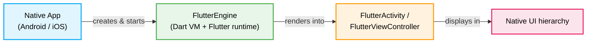
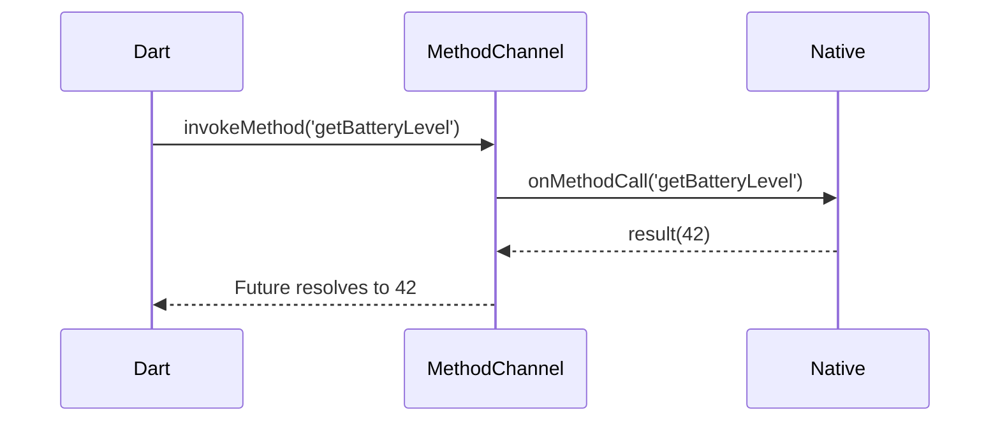

Not every Flutter project starts from scratch. Many teams have large, mature
native apps and want to adopt Flutter incrementally, one screen or one feature
at a time. Flutter supports this through a feature called
[**add-to-app**](https://docs.flutter.dev/add-to-app): the ability to embed a
Flutter module inside an existing Android or iOS application as a library
dependency.

Add-to-app is currently supported on Android, iOS, macOS, and web. This guide
focuses on the two most common platforms: Android and iOS.

## Why add-to-app?

The two primary use cases are:

- **Hybrid navigation stacks**: An app contains multiple screens, some rendered
  by Flutter and others by the native framework. The user navigates between them
  freely.
- **Partial-screen views**: A single native screen hosts both native views and
  Flutter widgets side by side. The Flutter portion renders one component (a
  chart, a form, a product card) while the rest of the screen stays native.

Beyond UI, add-to-app also lets you run shared non-UI Dart logic (networking,
business rules, cryptography) inside a native app, taking advantage of Dart's
portability and interoperability with other languages.

## Flutter module vs Flutter app

When you create a standalone Flutter app (`flutter create my_app`), the project
contains a complete `android/` and `ios/` host wrapper that Flutter owns
entirely. For add-to-app, you create a **Flutter module** instead:

```bash
flutter create --template=module my_flutter_module
```

The resulting structure is a little different from a regular app:

```
my_flutter_module/
  lib/
    main.dart          # Dart entry point
  pubspec.yaml
  .android/            # Auto-generated Android host (for standalone testing)
  .ios/                # Auto-generated iOS host (for standalone testing)
```

The `.android/` and `.ios/` directories are generated wrappers that let you run
the module in isolation with `flutter run`. They are prefixed with a dot to
signal that they are managed by Flutter, so never edit them directly. When the
module is embedded into your real native app, these wrappers are ignored. The
native project provides the host instead.

The Dart code inside `lib/` is identical to a regular Flutter app. The only
structural requirement is a valid entry point:

```dart
import 'package:flutter/material.dart';

@pragma('vm:entry-point')
void main() => runApp(const MyFlutterApp());
```

The `@pragma('vm:entry-point')` annotation prevents tree-shaking from removing
`main` in ahead-of-time (AOT) compiled builds.

## The FlutterEngine

Before any Flutter UI can appear on screen, the native app must start a Dart
runtime. That runtime is encapsulated in the `FlutterEngine` class.



A `FlutterEngine`:

- Starts a Dart isolate and executes the entry-point function (`main()` by
  default).
- Owns all platform channels between Dart and native code.
- Holds a reference to the active `FlutterRenderer` that draws pixels.

Starting an engine takes time, typically 100 to 200 ms on a modern device. If
you wait until the user taps a button to start the engine, they will see a
visible delay before the Flutter UI appears. The recommended pattern is to
**pre-warm** the engine before it is needed.

### Engine warm-up

#### Android

```kotlin
class MyApplication : Application() {
    lateinit var flutterEngine: FlutterEngine

    override fun onCreate() {
        super.onCreate()

        flutterEngine = FlutterEngine(this)

        // Start executing Dart code immediately.
        flutterEngine.dartExecutor.executeDartEntrypoint(
            DartExecutor.DartEntrypoint.createDefault()
        )

        // Cache the engine so FlutterActivity/FlutterFragment can reuse it.
        FlutterEngineCache
            .getInstance()
            .put("my_engine_id", flutterEngine)
    }
}
```

#### iOS

```swift
import Flutter

@main
class AppDelegate: FlutterAppDelegate {
    lazy var flutterEngine = FlutterEngine(name: "my_engine")

    override func application(
        _ application: UIApplication,
        didFinishLaunchingWithOptions launchOptions: [UIApplication.LaunchOptionsKey: Any]?
    ) -> Bool {
        // Start the engine. Dart's main() runs immediately.
        flutterEngine.run()
        GeneratedPluginRegistrant.register(with: self.flutterEngine)
        return super.application(application, didFinishLaunchingWithOptions: launchOptions)
    }
}
```

### Multiple engines

When you need to run more than one Flutter screen simultaneously, use
[`FlutterEngineGroup`](https://docs.flutter.dev/add-to-app/multiple-flutters)
rather than creating additional `FlutterEngine` instances directly.
`FlutterEngineGroup` spawns engines that share resources such as the GPU
context, font metrics, and the isolate group snapshot. Without that sharing,
each additional engine costs roughly 19 MB on Android and 13 MB on iOS. With
`FlutterEngineGroup`, each additional engine costs only about 180 KB of native
heap on top of the first.

#### Android

```kotlin
class MyApplication : Application() {
    val engines = FlutterEngineGroup(this)
}

// To spawn a new engine from an Activity:
val dartEntrypoint = DartExecutor.DartEntrypoint.createDefault()
val newEngine = (applicationContext as MyApplication)
    .engines
    .createAndRunEngine(this, dartEntrypoint)
```

#### iOS

```swift
// In AppDelegate
lazy var engineGroup = FlutterEngineGroup(name: "my_engine_group", project: nil)

// To spawn a new engine from a view controller:
let newEngine = (UIApplication.shared.delegate as! AppDelegate)
    .engineGroup
    .makeEngine(withEntrypoint: nil, libraryURI: nil)
```

Each engine produced by `FlutterEngineGroup` is still an independent Dart
program with its own isolate, state, and plugin registrations. The shared
resources are managed internally and do not affect isolation between engines.

## Android integration

### 1. Add the module as a Gradle dependency

There are two ways to depend on the Flutter module from your Android project.

**Option A: Source dependency (monorepo)**: Both projects sit on the same
machine. Gradle locates the module at build time:

```groovy
// settings.gradle (host app)
include ':app'

setBinding(new Binding([gradle: this]))
evaluate(new File(
    settingsDir.parentFile,
    'my_flutter_module/.android/include_flutter.groovy'
))
```

```groovy
// app/build.gradle
dependencies {
    implementation project(':flutter')
}
```

**Option B: AAR dependency (pre-built artifact)**: Build the module into an
Android Archive and distribute it as a binary:

```bash
# Run inside the Flutter module directory.
flutter build aar
```

This produces `.aar` files for each build type (debug, profile, release). Add
the output repository and dependencies to your host app's `build.gradle`.

### 2. Choose a display mechanism

Flutter provides three ways to show Flutter content in an Android app:

| API               | Best for                                        |
| ----------------- | ----------------------------------------------- |
| `FlutterActivity` | Full-screen Flutter experiences                 |
| `FlutterFragment` | Embedding Flutter inside an existing `Activity` |
| `FlutterView`     | Manual, fine-grained layout control             |

#### FlutterActivity

The simplest path to a full-screen Flutter screen:

```kotlin
// Using a cached, pre-warmed engine (recommended).
val intent = FlutterActivity
    .withCachedEngine("my_engine_id")
    .build(context)
startActivity(intent)
```

If you have not pre-warmed an engine, use
`FlutterActivity.createDefaultIntent(context)` instead. Flutter will start a new
engine when the `Activity` is created, which introduces a cold-start delay.

#### FlutterFragment

Embed Flutter inside any existing `FragmentActivity`:

```kotlin
val flutterFragment = FlutterFragment
    .withCachedEngine("my_engine_id")
    .build<FlutterFragment>()

supportFragmentManager
    .beginTransaction()
    .add(R.id.fragment_container, flutterFragment, "flutter_fragment")
    .commit()
```

#### FlutterView

For maximum flexibility, attach a `FlutterView` directly in your layout:

```kotlin
val flutterView = FlutterView(context)
myConstraintLayout.addView(flutterView)

// Attach the engine's renderer to this view.
flutterView.attachToFlutterEngine(flutterEngine)
```

Call `flutterView.detachFromFlutterEngine()` before attaching the engine to a
different view. An engine can only render into one view at a time.

## iOS integration

### 1. Add the module as a dependency

Since Flutter 3.44, the recommended method is **Swift Package Manager (SPM)**.
CocoaPods remains supported but is in maintenance mode.

**Swift Package Manager setup**: Run the following command in the Flutter module
directory to generate an XCFramework:

```bash
flutter build ios-framework --xcframework --output=../MyFlutterPackage
```

Then add the local package in Xcode: **File > Add Package Dependencies > Add
Local**, and point to the generated `MyFlutterPackage` directory.

**CocoaPods setup** (alternative):

```ruby
# Podfile (host app)
flutter_application_path = '../my_flutter_module'
load File.join(flutter_application_path, '.ios', 'Flutter', 'podhelper.rb')

target 'MyApp' do
  install_all_flutter_pods(flutter_application_path)
end
```

### 2. Display Flutter content

#### Full-screen: FlutterViewController

```swift
import Flutter

class HomeViewController: UIViewController {
    @IBAction func showFlutter(_ sender: Any) {
        let appDelegate = UIApplication.shared.delegate as! AppDelegate
        let flutterEngine = appDelegate.flutterEngine

        let flutterViewController = FlutterViewController(
            engine: flutterEngine,
            nibName: nil,
            bundle: nil
        )

        present(flutterViewController, animated: true, completion: nil)
    }
}
```

#### Partial-screen: FlutterViewController as a child

To embed Flutter inside part of an existing `UIViewController`:

```swift
let flutterVC = FlutterViewController(
    engine: appDelegate.flutterEngine,
    nibName: nil,
    bundle: nil
)

// Add as a child view controller.
addChild(flutterVC)
flutterVC.view.frame = CGRect(x: 0, y: 200, width: view.bounds.width, height: 300)
view.addSubview(flutterVC.view)
flutterVC.didMove(toParent: self)
```

## Platform channels

Platform channels are how Dart and native code send messages to each other. The
most common type is `MethodChannel`, which uses an asynchronous request/response
model.



### Dart side

```dart
const channel = MethodChannel('com.example.myapp/battery');

Future<int> getBatteryLevel() async {
  final int level = await channel.invokeMethod('getBatteryLevel');
  return level;
}
```

### Android side (Kotlin)

```kotlin
val channel = MethodChannel(
    flutterEngine.dartExecutor.binaryMessenger,
    "com.example.myapp/battery"
)

channel.setMethodCallHandler { call, result ->
    if (call.method == "getBatteryLevel") {
        val level = getBatteryLevel()
        if (level != -1) {
            result.success(level)
        } else {
            result.error("UNAVAILABLE", "Battery level unavailable", null)
        }
    } else {
        result.notImplemented()
    }
}
```

### iOS side (Swift)

```swift
let channel = FlutterMethodChannel(
    name: "com.example.myapp/battery",
    binaryMessenger: flutterViewController.binaryMessenger
)

channel.setMethodCallHandler { call, result in
    guard call.method == "getBatteryLevel" else {
        result(FlutterMethodNotImplemented)
        return
    }
    result(UIDevice.current.batteryLevel * 100)
}
```

Channel names must be unique across the application. Use reverse-domain notation
(`com.yourcompany.appname/feature`) to avoid collisions with plugins.

## Multi-engine vs multi-view

Flutter supports two flavors of add-to-app depending on the platform:

|                   | Multi-engine                                     | Multi-view                                             |
| ----------------- | ------------------------------------------------ | ------------------------------------------------------ |
| **Platforms**     | Android, iOS, macOS                              | Web                                                    |
| **Dart programs** | One per engine (isolated)                        | One shared program                                     |
| **State sharing** | Not possible between engines                     | Full object sharing                                    |
| **Memory cost**   | Higher (one VM per engine)                       | Lower                                                  |
| **Use case**      | Independent Flutter screens with no shared state | Multiple embedded Flutter widgets on the same web page |

On Android and iOS, each `FlutterEngine` runs its own Dart isolate. Isolates
share no memory, so communication between them requires explicit message passing
via `Isolate.sendPort`. If two embedded Flutter screens need to share
application state, consider using a single engine and routing between named
routes inside Flutter rather than spinning up a second engine.

## Performance considerations

### Warm-up timing

Start the `FlutterEngine` in `Application.onCreate()` (Android) or
`application(_:didFinishLaunchingWithOptions:)` (iOS), not when the user
triggers a navigation action. The first call to
`dartExecutor.executeDartEntrypoint` is where the Dart VM initializes and the
most latency is incurred.

### First-frame jank

Even with a pre-warmed engine, the first Flutter frame must compile all
necessary shaders. Enabling [Impeller](https://docs.flutter.dev/perf/impeller)
eliminates shader compilation jank. Impeller is the default renderer on iOS and
on Android (API 29+) as of Flutter 3.27. It compiles a fixed set of pre-built
Metal/Vulkan shaders at engine start and never compiles at runtime.

### Memory overhead

The cost of each additional engine depends on how it is created:

|                        | Plain `FlutterEngine()`        | `FlutterEngineGroup`           |
| ---------------------- | ------------------------------ | ------------------------------ |
| Additional native heap | ~19 MB (Android), ~13 MB (iOS) | ~180 KB                        |
| Dart heap (initial)    | ~1 MB                          | ~1 MB                          |
| Dart heap (loaded app) | Proportional to app complexity | Proportional to app complexity |

The ~180 KB figure cited in Flutter's documentation applies specifically to
engines spawned from `FlutterEngineGroup`, which shares the GPU context, font
cache, and isolate group snapshot across all engines in the group. A standalone
`FlutterEngine()` does not benefit from that sharing, so each one carries the
full cost.

Avoid pre-warming engines that the user is unlikely to reach. Lazy
initialization (creating the engine on first navigation) is acceptable for
infrequently visited screens where a small delay is tolerable.

### Texture and platform view overhead

When Flutter renders inside a native view hierarchy, it composites its texture
with the native rendering layer. On Android, this uses a `SurfaceTexture` or
`SurfaceView` depending on the display mode. On iOS, it uses a `CALayer`. The
compositing step adds a small GPU cost; for partial-screen views where Flutter
covers only a fraction of the screen, this cost is negligible.

## Further reading

- [Add Flutter to an existing app](https://docs.flutter.dev/add-to-app): the
  official add-to-app overview.
- [Add Flutter to Android](https://docs.flutter.dev/add-to-app/android): the
  official Android platform guide.
- [Add Flutter to iOS](https://docs.flutter.dev/add-to-app/ios): the official
  iOS platform guide.
- [Multiple Flutter instances](https://docs.flutter.dev/add-to-app/multiple-flutters):
  a deep dive on multi-engine patterns.
- [Writing platform-specific code](https://docs.flutter.dev/platform-integration/platform-channels):
  the complete platform channels reference.
