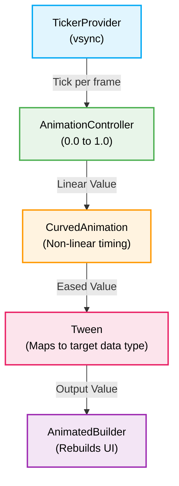

The Flutter animation framework provides a layered architecture for controlling
motion. At its core, the framework categorizes animations into implicit
transitions, explicit controller-driven animations, and physics-based
simulations.

## Implicit animations

Implicit animations automatically interpolate between a current value and a new
target value over a specified duration. The framework calculates intermediate
frames when a property changes and the widget rebuilds.

`AnimatedContainer` is a versatile implicit widget that can animate changes to
size, color, padding, and alignment simultaneously:

```dart
AnimatedContainer(
  duration: const Duration(milliseconds: 300),
  curve: Curves.easeInOut,
  width: isExpanded ? 200 : 100,
  decoration: BoxDecoration(
    color: isExpanded ? Colors.blue : Colors.red,
    borderRadius: BorderRadius.circular(isExpanded ? 16.0 : 8.0),
  ),
  child: const Text('Hello'),
)
```

The underlying architecture relies on `ImplicitlyAnimatedWidget`. When the
widget's configuration changes (detected in `didUpdateWidget`), the state reuses
its internal `AnimationController`, rebases the tween's `begin` to the current
animation value, and restarts the transition toward the new target. This is why
implicit animations transition smoothly when interrupted mid-flight.

### Non-linear interpolation (curves)

By default, animations transition linearly. Applying a `Curve` modifies the
interpolation rate. The framework provides standard curves via the `Curves`
class, such as `Curves.easeIn`, `Curves.bounceOut`, and `Curves.elasticInOut`.
You can also define custom mathematical curves by subclassing `Curve` and
overriding the `transformInternal` method.

## Explicit animations

Explicit animations require manual lifecycle management using an
`AnimationController`. This approach is necessary for looping animations,
sequenced transitions, and animations triggered by gesture events.



### Animation controllers and vsync

An `AnimationController` generates a new value whenever the hardware is ready
for a new frame. To prevent off-screen computations and synchronize with the
device refresh rate, the controller requires a `TickerProvider` (passed via the
`vsync` argument).

```dart
class _MyWidgetState extends State<MyWidget> with SingleTickerProviderStateMixin {
  late final AnimationController _controller;

  @override
  void initState() {
    super.initState();
    _controller = AnimationController(
      duration: const Duration(seconds: 2),
      vsync: this,
    );
  }

  @override
  void dispose() {
    // Not calling dispose() leaks the Ticker. In debug mode, the mixin's
    // dispose() throws "was disposed with an active Ticker" if the controller
    // is still animating when the State is removed from the tree.
    _controller.dispose();
    super.dispose();
  }
}
```

When managing multiple controllers in a single widget, use
`TickerProviderStateMixin` instead of `SingleTickerProviderStateMixin`.

```dart
class _MyWidgetState extends State<MyWidget> with TickerProviderStateMixin {
  late final AnimationController _controllerA;
  late final AnimationController _controllerB;
}
```

### Tweens and mapping

A controller typically outputs values between `0.0` and `1.0`. A `Tween` maps
this unit interval to a required data type (such as `Offset` or `double`). For
types that lack arithmetic operators, use a dedicated subclass: `ColorTween` for
colors, `RectTween` for rectangles, and so on.

```dart
final Animation<double> sizeAnimation = Tween<double>(
  begin: 10.0,
  end: 100.0,
).animate(
  CurvedAnimation(
    parent: _controller,
    curve: Curves.easeOut,
  ),
);
```

### Rebuilding the UI

To apply the animation to the render tree, use an `AnimatedBuilder` or subclass
`AnimatedWidget`. This localized rebuilding prevents the entire widget tree from
refreshing on every frame.

```dart
AnimatedBuilder(
  animation: sizeAnimation,
  builder: (BuildContext context, Widget? child) {
    return Container(
      width: sizeAnimation.value,
      height: sizeAnimation.value,
      color: Colors.blue,
      child: child, // passed through; not rebuilt on each tick
    );
  },
  child: const FlutterLogo(),
)
```

Alternatively, `TweenAnimationBuilder` provides a declarative API that does not
require a manually managed `AnimationController`. Whenever the tween's `end`
value changes, the widget re-animates from the current value toward the new
target, making it well-suited for driven transitions and entrance animations
where that retargeting behavior is desirable.

```dart
TweenAnimationBuilder<double>(
  tween: Tween<double>(begin: 0.0, end: 1.0),
  duration: const Duration(milliseconds: 600),
  curve: Curves.easeOut,
  builder: (BuildContext context, double value, Widget? child) {
    return Opacity(
      opacity: value,
      child: child,
    );
  },
  child: const Text('Fades in on first build'),
)
```

## Physics-based simulations

For animations that must react naturally to user input (such as a scroll view
snapping into place), use the physics simulation engine rather than
fixed-duration controllers.

The `AnimationController` can execute a `Simulation` using
`controller.animateWith(Simulation)`. The framework provides several standard
physics models:

- `SpringSimulation`: Models tension and friction.
- `GravitySimulation`: Models gravitational acceleration.
- `FrictionSimulation`: Models gradual deceleration.

```dart
// Use AnimationController.unbounded so the controller is not clamped to
// [0.0, 1.0]. A standard controller would clip the spring's range immediately.
final AnimationController controller = AnimationController.unbounded(vsync: this);

final SpringDescription spring = SpringDescription(
  mass: 1.0,
  stiffness: 100.0,
  damping: 10.0,
);

final SpringSimulation simulation = SpringSimulation(
  spring,
  0.0, // start position
  100.0, // end position
  0.0, // initial velocity
);

controller.animateWith(simulation);
```

## Third-party vector animations

For complex vector graphics and state-machine animations, use third-party
formats rather than the built-in widget framework:

- **[Lottie](https://lottiefiles.com/)**: Uses animations exported as JSON from
  Adobe After Effects. Best for predetermined, timeline-based animations.
- **[Rive](https://rive.app/)**: Uses interactive state machines designed for
  real-time manipulation. Best for dynamic assets requiring programmatic state
  changes.

## Performance considerations

Modifying properties that affect layout (such as `width`, `height`, or
`padding`) forces the framework to recalculate geometry on every frame, which
can cause dropped frames.

To optimize performance, animate properties that are applied during the paint
phase, which avoids rebuilds and layout recalculation:

- **Opacity**: Use `FadeTransition` or `AnimatedOpacity`.
- **Transform**: Use `RotationTransition`, `ScaleTransition`, or
  `SlideTransition`.

When using `AnimatedBuilder`, always pass static child widgets via the `child`
parameter. This prevents the framework from recreating the child subtree during
every animation tick.

For complex subtrees that animate independently from the rest of the screen,
wrap them in a `RepaintBoundary`. This isolates the subtree into its own layer,
so its repaints do not propagate to the rest of the tree.

```dart
RepaintBoundary(
  child: RotationTransition(
    turns: _controller,
    child: const FlutterLogo(size: 100),
  ),
)
```
