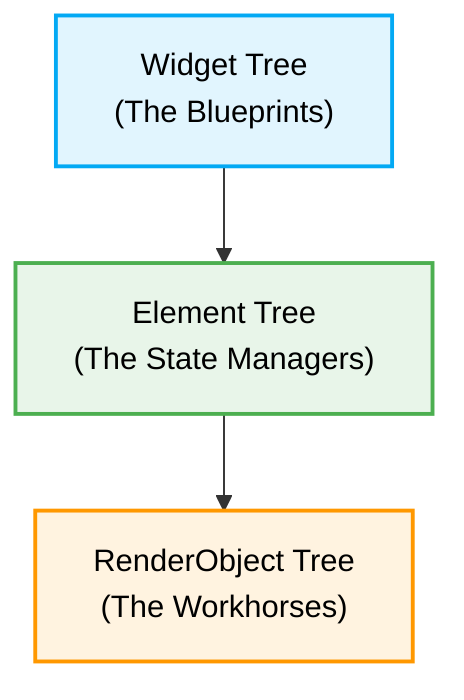

If you’ve spent any time with Flutter, you’ve probably heard the phrase:
_"Everything is a widget."_ While that's a fantastic way to think about building
your app, it's not the whole story. If you want to build really smooth,
high-performing apps, it helps to peek under the hood and see what's actually
happening.

When the Flutter framework was designed, there was a distinct goal:
**[keep things consistently fast and smooth at 60 (or even 120) frames per second.](https://docs.flutter.dev/perf)**
To pull that off, Flutter avoids using a single, heavy structure (like the DOM
in web development). Instead, it uses a team of three different "trees" working
together: the **Widget Tree**, the **Element Tree**, and the **RenderObject
Tree**.

Let's break down what each tree does and how they team up to paint pixels on
your screen.



## 1. The Widget Tree: Your Blueprints

Widgets are what you write every day: `Container`, `Text`, `Row`, `Column`, and
so on.

But what _is_ a Widget, really? **Think of a widget as an immutable blueprint.**

Widgets don't actually draw anything on the screen. They are super lightweight
Dart objects that just hold configuration data, like "this should be blue" or
"this needs 10 pixels of padding." Because they are just simple data containers
and never change (immutable), Flutter can toss them out and rebuild millions of
them every second without breaking a sweat.

When you call `setState()`, you aren’t directly telling the screen to redraw.
You are just telling Flutter to throw away the old stale objects and create new
ones from the blueprints you created. ones.

## 2. The Element Tree: The State Manager

If widgets are just temporary blueprints, how does Flutter remember anything?
How does it keep track of an animation playing, or what you typed into a text
field?

Enter the **Element Tree** (where your `State` lives!).

For every Widget you put in your app, Flutter creates a corresponding
**Element**. You can think of the Element Tree as the brain or the skeleton of
your app. Unlike widgets, **Elements stick around and can change over time.**
For `StatefulWidgets`, the Element is what actually holds onto the `State`
object you interact with daily.

When a new Widget Tree is built, Flutter doesn't throw away the Element Tree.
Instead, it looks at the new blueprints and compares them to the existing
Elements:

- If the new widget looks like the old one (same type and key), the Element just
  says, "Cool, I'll update my settings" and stays right where it is.
- If the widget type completely changed, the old Element is tossed out, and a
  brand new one takes its place.

This is the secret to Flutter's speed! The Element Tree manages the lifecycle
and acts as the smart middleman that decides when actual heavy lifting needs to
be done.

## 3. The RenderObject Tree: The Workhorse

Finally, we have the **RenderObject Tree**.

While Widgets hold the blueprints and Elements manage the brains,
RenderObjects do the heavy lifting: **figuring out exactly how big things are,
where they go on the screen, and painting the actual pixels.**

For every visual Element in your app, there's a RenderObject. These are heavy
and expensive to create, which is exactly why the Element Tree protects them.
RenderObjects contain all the complicated math needed to measure constraints and
tell the graphics engine how to draw.

If you change a `Container` from blue to red, the Widget is recreated, the
Element updates its state, but the _exact same_ RenderObject is kept around;
it's simply told, "Hey, next time you draw, use red paint instead of blue."

## The Lifecycle: Putting It All Together

Let's walk through what happens when you tap a button that changes a color:

1. **You tap the button**: `setState()` is called.
2. **New Blueprints**: Flutter asks your `build` method for new widgets. A new
   Widget Tree is spun up instantly.
3. **Checking the Changes**: The Element Tree looks at the new widgets and
   compares them to the old ones. It notices that only a color changed.
4. **Passing the Message**: The Element updates its internal reference to the
   new widget and passes the message down to its RenderObject about the new
   color.
5. **Painting**: The RenderObject marks itself as needing a fresh coat of paint
   (`markNeedsPaint()`). On the very next frame, the engine asks that specific
   RenderObject to redraw itself, leaving everything else untouched.

## The Secret Identity of BuildContext

If you've written any Flutter code, you've seen this:

```dart
@override
Widget build(BuildContext context) {
  return Container();
}
```

You might have wondered, _"What exactly is that `context` thing?"_

Here is the biggest "Aha!" moment for most Flutter beginners: **`BuildContext`
is actually just the Element!**

When Flutter asks your widget to build itself, it hands you the `BuildContext`.
It's just the Element saying, "Here I am in the tree! If you need to
find an ancestor widget (like a `Theme` or a `Navigator`), you can use me to
look up the tree."


## Why This Matters

By splitting the work into blueprints (Widgets), brains (Elements), and brawn
(RenderObjects), Flutter gives you a really friendly way to code without giving
up any of that sweet native-level performance.

Understanding this team of three trees makes you a much better Flutter
developer:

- You'll understand why
  [`Keys`](https://api.flutter.dev/flutter/foundation/Key-class.html) are
  sometimes needed (they help the Element tree match up widgets correctly when
  you reorder lists).
- You'll realize why creating lots of widgets is totally fine, but stacking
  unnecessary deep widgets like
  [`Opacity`](https://api.flutter.dev/flutter/widgets/Opacity-class.html) or
  [`Clip`](https://api.flutter.dev/flutter/widgets/ClipRect-class.html) (which
  create heavy RenderObjects) can slow things down.
- You'll know exactly what's happening under the hood, making debugging and
  optimizing a breeze.
