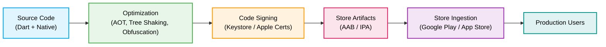

{/* cspell:words appbundle keytool genkey keyalg keysize proguard xcprivacy symbolication symbolicate symbolicating */}

import { Steps } from '@astrojs/starlight/components';
import { LinkCard } from 'starlight-theme-nova/components';

Releasing a Flutter app transforms your local Dart codebase and native platform
wrappers into hardened, cryptographically signed binaries. Under the hood, the
Flutter build engine compiles your Dart code Ahead-of-Time (AOT), strips debug
runtimes, minifies assets, and packages native platform artifacts for
distribution on [Google Play](https://play.google.com/console/about/) and the
[Apple App Store](https://developer.apple.com/app-store/).

This guide explains the Flutter release lifecycle, how the build pipeline
transforms your Dart and native code into store-ready artifacts, and the core
architectural prerequisites for production deployments.



## Flutter build modes

Flutter compiles applications in three distinct
[build modes](https://docs.flutter.dev/testing/build-modes): **Debug**,
**Profile**, and **Release**. Choosing the correct build mode is critical
because each mode trades debugging convenience for execution performance.

| Feature                  | Debug Mode                    | Profile Mode                 | Release Mode              |
| :----------------------- | :---------------------------- | :--------------------------- | :------------------------ |
| **Compilation**          | Just-in-Time (JIT)            | Ahead-of-Time (AOT)          | Ahead-of-Time (AOT)       |
| **Hot reload / restart** | Supported                     | Disabled                     | Disabled                  |
| **Debugging tools**      | Full DevTools & VM service    | DevTools tracing & profiling | Disabled                  |
| **Debug banner**         | Visible                       | Hidden                       | Hidden                    |
| **Binary size**          | Large (includes VM & AST)     | Optimized for tracing        | Fully stripped & minified |
| **Execution speed**      | Slower (unoptimized bytecode) | Near-native                  | Maximum native speed      |

### Debug mode

During development, Flutter uses Dart's JIT compiler. The Dart VM compiles code
on the fly, enabling stateful hot reload and full step-debugging. However, debug
binaries contain debugging symbols and the Dart VM runtime, resulting in larger
file sizes and slower execution. Never ship debug builds to end users.

### Profile mode

Profile mode compiles Dart code Ahead-of-Time to native machine code using
`gen_snapshot`, matching the runtime performance of release mode while keeping
performance tracing hooks and
[Flutter DevTools](https://docs.flutter.dev/tools/devtools) CPU/memory profilers
active. This mode is ideal for diagnosing frame drops
([jank](https://docs.flutter.dev/perf)) and memory leaks on real hardware.

### Release mode

Release builds apply aggressive compiler optimizations:

- Unused code and dead branches are eliminated via tree shaking.
- Dart code is compiled to native ARM machine code (`libapp.so` on Android,
  `App.framework` on iOS).
- Debugging assertions (`assert()` statements), debug banners, and the VM
  service are completely stripped from the final binary.
- Assets and font icons are minified.

To produce a release artifact, pass the `--release` flag (which is the default
for `flutter build appbundle` and `flutter build ipa`).

:::note

Because `assert()` statements only execute in debug mode and are removed in
release builds, avoid putting critical application logic or state mutations
inside assertions.

:::

## App versioning and build numbers

Mobile operating systems and app stores track versions through two distinct
identifiers: a user-visible version string and an internal numeric build
counter.

In Flutter, you define both in your `pubspec.yaml` file using the format
`version: <version-name>+<build-number>`:

```yaml
# pubspec.yaml
name: my_app
description: A production Flutter application.
version: 1.2.0+42
```

In this example:

- `1.2.0` represents the **Version Name**
  ([Semantic Versioning](https://semver.org/): `MAJOR.MINOR.PATCH`).
- `42` represents the **Build Number** (an integer that increments with every
  build).

### Platform mapping

Flutter automatically injects these values into the native build configurations:

- **Android**: `version` maps to `versionName` in `build.gradle`, and `+42` maps
  to `versionCode` (see
  [Android versioning](https://docs.flutter.dev/deployment/android#updating-the-apps-version-number)).
- **iOS**: `version` maps to `CFBundleShortVersionString` in `Info.plist`, and
  `+42` maps to `CFBundleVersion` (see
  [iOS versioning](https://docs.flutter.dev/deployment/ios#updating-the-apps-version-number)).

### Overriding version parameters in CI/CD

When building in automated CI/CD pipelines, you can override the values in
`pubspec.yaml` without modifying source files by passing CLI flags:

```bash
flutter build appbundle --build-name=1.2.1 --build-number=43
flutter build ipa --build-name=1.2.1 --build-number=43
```

:::note

Both the [Google Play Console](https://play.google.com/console/about/) and
[App Store Connect](https://appstoreconnect.apple.com/) enforce monotonically
increasing build numbers. Once you upload an artifact with build number `42`,
the store will reject any subsequent upload with a build number equal to or
lower than `42`, even if the version name changes.

:::

## Compile-time environment configuration

Avoid hardcoding production API keys or backend URLs in your code. Pass
configuration values at compile time using `--dart-define` or
`--dart-define-from-file`:

```bash
flutter build appbundle --release \
  --dart-define=API_URL=https://api.example.com \
  --dart-define=ENVIRONMENT=production

# Or load from a JSON/env configuration file:
flutter build appbundle --release \
  --dart-define-from-file=config/production.json
```

Access these variables in Dart using `String.fromEnvironment()`:

```dart
const apiUrl = String.fromEnvironment(
  'API_URL',
  defaultValue: 'https://api.staging.example.com',
);
```

## Code obfuscation and debug symbols

To protect proprietary business logic and reduce binary size, enable Dart AOT
obfuscation during the release build. For further details, refer to the
[Flutter Obfuscation Guide](https://docs.flutter.dev/deployment/obfuscate).

### Enabling obfuscation

Obfuscation replaces symbol identifiers with short, non-descriptive names and
strips debug symbols:

```bash
flutter build appbundle --release \
  --obfuscate \
  --split-debug-info=./build/symbols/android

flutter build ipa --release \
  --obfuscate \
  --split-debug-info=./build/symbols/ios
```

- `--obfuscate`: Obfuscates Dart code names.
- `--split-debug-info=<directory>`: Extracts debug symbol tables into separate
  symbol files rather than embedding them into the compiled binary.

### Symbolicating crash logs

When an obfuscated app crashes in production, the stack trace contains memory
addresses and obscured names. Use the saved symbol files to restore original
file names and line numbers:

```bash
flutter symbolize \
  --input=stacktrace.txt \
  --symbols=./build/symbols/android/app.android-arm64.symbols
```

Upload these symbol files to crash reporting providers to enable automatic stack
trace symbolication:

- [Uploading Symbols to Shorebird](/code-push/crash-reporting/uploading-symbols/)
- [Firebase Crashlytics Integration](/code-push/crash-reporting/crashlytics/)
- [Sentry Integration](/code-push/crash-reporting/sentry/)

## Binary size optimization

Keeping download sizes low improves conversion rates and user retention. Flutter
provides built-in diagnostics to analyze binary contents (see
[Flutter App Size](https://docs.flutter.dev/perf/app-size)).

### Analyzing application size

Generate a JSON size breakdown during the build:

```bash
flutter build appbundle --analyze-size
flutter build ipa --analyze-size
```

This command outputs a detailed summary of your package size and produces a size
report JSON file. You can load this file into Flutter DevTools (**App Size
Tool**) to inspect:

- Largest compiled Dart libraries and native dependencies.
- Asset overhead (images, audio, custom fonts).
- Unused resource opportunities.

### Optimization techniques

1. **Tree shake icons**: Flutter automatically tree-shakes font icons by default
   in release builds (`--tree-shake-icons`), keeping only the glyphs actually
   referenced in code.
2. **Compress assets**: Convert large PNG assets to WebP or vector formats
   (SVGs).
3. **Deferred loading**: Use
   [deferred components](https://docs.flutter.dev/perf/deferred-components)
   (`import 'package:.../feature.dart' deferred as feature;`) to download
   complex application modules on demand.
4. **Android resource shrinking**: Enable `shrinkResources true` and
   `minifyEnabled true` in `build.gradle` to strip unused native resources.

## Automating releases with CI/CD

Manual release processes are error-prone and slow down deployment cadence.
Modern teams automate compilation, code signing, and distribution using CI/CD
pipelines.

Popular tools and workflows:

- **Fastlane**: Open-source automation tool for generating screenshots, managing
  provisioning profiles (`fastlane match`), and deploying to stores (`supply`
  for Google Play, `deliver` / `pilot` for App Store Connect). See the
  [Fastlane Integration Guide](/code-push/ci/fastlane/).
- **GitHub Actions**: Cloud workflows for continuous integration and automated
  tag-triggered release builds. See the
  [GitHub Actions Guide](/code-push/ci/github/).
- **Codemagic**: A CI/CD service purpose-built for Flutter that manages code
  signing certificates and direct store delivery. See the
  [Codemagic Integration Guide](/code-push/ci/codemagic/).

## Shorebird: updating production apps instantly

A traditional app store release cycle requires compiling a new binary,
submitting it to Google Play or Apple App Store, waiting for review (hours to
days), and waiting for users to download the update.

```mermaid
graph TD
    subgraph Traditional Store Release
        A[Code Change] --> B[Full Binary Build]
        B --> C[Store Review]
        C --> D[User Downloads App Update]
    end

    subgraph Shorebird Code Push
        E[Dart Code Fix] --> F[shorebird patch]
        F --> G[Instant Cloud Delivery]
        G --> H[App Applies Patch on Next Launch]
    end

    style A fill:#ffebee,stroke:#f44336,stroke-width:2px,color:#000
    style B fill:#ffebee,stroke:#f44336,stroke-width:2px,color:#000
    style C fill:#ffebee,stroke:#f44336,stroke-width:2px,color:#000
    style D fill:#ffebee,stroke:#f44336,stroke-width:2px,color:#000

    style E fill:#e8f5e9,stroke:#4caf50,stroke-width:2px,color:#000
    style F fill:#e8f5e9,stroke:#4caf50,stroke-width:2px,color:#000
    style G fill:#e8f5e9,stroke:#4caf50,stroke-width:2px,color:#000
    style H fill:#e8f5e9,stroke:#4caf50,stroke-width:2px,color:#000
```



[Shorebird](https://shorebird.dev) integrates Code Push capabilities into your
Flutter release strategy (see [Getting Started](/getting-started/)):

1. **Create a base store release**: Build your release artifact using Shorebird
   CLI instead of standard Flutter tooling (see
   [Shorebird Release](/code-push/release/)):
   ```bash
   shorebird release android
   shorebird release ios
   ```
   Submit the resulting artifact to Google Play and Apple App Store as normal.
2. **Deploy instant patches**: When you need to fix a bug or push an urgent
   change to Dart code, deploy a patch (see
   [Shorebird Patch](/code-push/patch/)):
   ```bash
   shorebird patch android
   shorebird patch ios
   ```
   Patches bypass store review delays and install seamlessly in the background
   on user devices.

### When to use a store release vs a Code Push patch

- **Store release required**: Adding new native plugins, modifying native
  Android/iOS configurations (e.g., `AndroidManifest.xml`, `Info.plist`,
  `build.gradle`, `Podfile`), or upgrading the Flutter engine version.
- **Code Push patch supported**: Modifying Dart widgets, updating business
  logic, adjusting styling, fixing calculation bugs, or refining state
  management.

## Release checklist

Before publishing your application build to production tracks, verify every item
on this checklist:

<Steps>

1. **Verify build mode**

   Ensure all release artifacts are compiled with `--release`.

2. **Increment version numbers**

   Update `version` in `pubspec.yaml` with an incremented build number and
   proper semantic version string.

3. **Check permissions and privacy compliance**

   Ensure all native permission strings in `AndroidManifest.xml` and
   `Info.plist` have clear, compliant descriptions. Verify that iOS Privacy
   Manifests are included if using required reason APIs.

4. **Verify environment and API keys**

   Ensure production endpoints and keys are configured (using `--dart-define` or
   secure remote configs) instead of development credentials.

5. **Test on real devices**

   Test release builds on physical iOS and Android hardware across different
   screen sizes and OS versions.

6. **Backup signing keys**

   Store your Android release keystores, key aliases, passwords, and Apple
   distribution certificates in a secure credentials manager.

7. **Verify crash reporting and symbolication**

   Confirm that crash reporting SDKs (Sentry, Crashlytics) receive events and
   that debug symbols (`--split-debug-info`) are uploaded.

</Steps>

## Platform release guides

Continue to the dedicated platform guides to prepare and publish store
artifacts:

<LinkCard
  href="/flutter-concepts/releasing-flutter-apps/android"
  title="Releasing for Android (Google Play)"
  description="Generate upload keystores, configure Gradle signing, build AABs, and configure Google Play Console tracks."
/>
<LinkCard
  href="/flutter-concepts/releasing-flutter-apps/ios"
  title="Releasing for iOS (Apple App Store)"
  description="Configure Xcode signing identities, Privacy Manifests, build IPAs, and distribute via TestFlight and App Review."
/>
