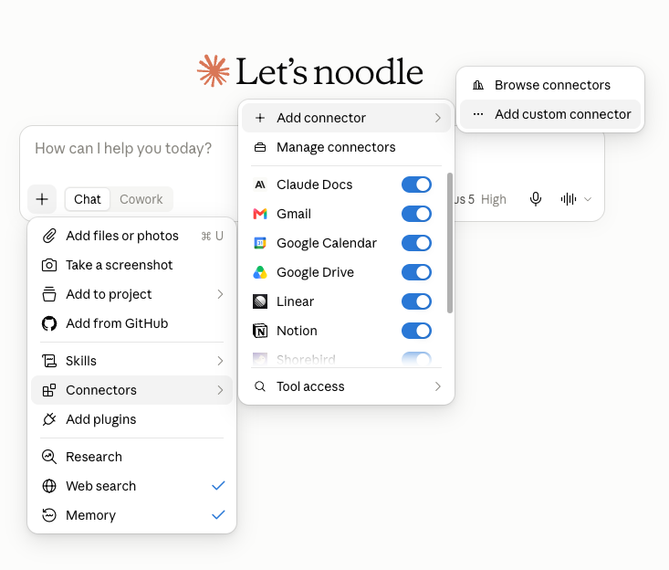
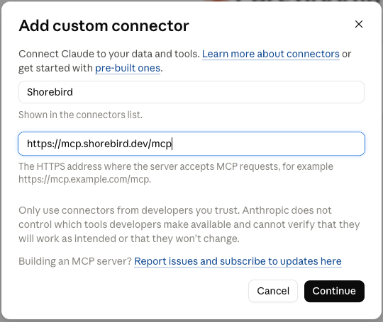

import { Aside, Steps, Tabs, TabItem } from '@astrojs/starlight/components';

<Aside type="caution" title="Prototype">
  Shorebird Zap is an early prototype available to a limited set of customers.
  Behavior and commands may change without notice, and there may be rough edges.
  [Feedback is welcome](https://forms.gle/fjfjb1SMMnDz2VEN9).
</Aside>

## What is Shorebird Zap?

Shorebird Zap is a tool for running, using, and improving Flutter projects on
your mobile device. It allows you to quickly preview changes made to your
Flutter project by a coding agent, so you can feel the user experience
firsthand, and rapidly iterate on improvements.

The core cycle for using Shorebird Zap is:

1. Build a Flutter project with a coding agent
2. Open, use, and annotate your project with Shorebird Zap
3. Instruct your agent to apply changes based on your annotations
4. Repeat steps 2 and 3 until you are satisfied

**Shorebird Zap is for previewing your personal Flutter projects only: it does
not allow you to publish, share, collaborate on, or distribute your app.**

### How it works

Zap works by hosting a build of your Flutter project on Shorebird
infrastructure, and serving it to the Zap app, along with a set of tools for
annotating and improving the user experience. The infrastructure around Zap is
optimized to work with AI agents, and you bring your own, rather than you
needing to go through some proprietary Shorebird agent.

## Requirements

- iOS 15.0 or greater, or Android 7.0 or greater
- A Shorebird account or beta key
- A repo with at least 1 commit (a committed empty README file is enough)
- Your preferred coding agent

<Aside type="caution" title="Claude Code only">
  Right now, Shorebird Zap only supports Claude Code. Support for other coding
  agents and platforms (Cursor, Codex, Antigravity) is coming soon.
</Aside>

## Installing

<Tabs>
  <TabItem label="Android">
    <Steps>

    1. Join the [Shorebird Companion Google Group](https://groups.google.com/a/shorebird.dev/g/shorebirdcompanion)

    2. Join the [testing group](https://play.google.com/apps/testing/dev.shorebird.companion) for the app
      <Aside type="note">It may take 5 to 10 minutes for your membership to allow you to download the app</Aside>

    3. [Download and install](https://play.google.com/store/apps/details?id=dev.shorebird.companion) the app

    </Steps>

  </TabItem>

  <TabItem label="iOS">
    Visit [Shorebird's TestFlight link](https://testflight.apple.com/join/5zqR6tQx) and install the app.
  </TabItem>
</Tabs>

## Using Zap

To use Zap, you will first create a Zap project via your AI coding agent. Then,
you'll open it with the Shorebird Zap companion application, leave Notes, and
iterate on the user experience.

### Create a Zap project

To create a Zap, you will need access to Claude Code. **It's recommended, but
not required, to use Shorebird's MCP server.**

<Tabs>

  <TabItem label="With MCP">

    <Steps>

    1.  **If you already have the Shorebird MCP installed,
        [skip to step 3](#skip-mcp).** Otherwise, install the MCP.

        The Shorebird MCP isn't available in official plugin/MCP marketplaces
        yet, so you'll need to add a custom connector.

        

        Set the name to anything you'd like, and the URL to
        `https://mcp.shorebird.dev/mcp`

        

    2.  Use the default authentication settings, and authenticate the MCP using
        your Shorebird account (via OAuth).

    3.  <a id="skip-mcp"></a>Create a new coding agent thread and connect it to
        your GitHub repo

        <Aside type="note" title="Local source">
          If you are using an agent platform that supports local source control,
          like Claude Code Desktop or CLI, you can have your agent build locally
          instead.
        </Aside>

    4.  Prompt your agent to build you an app using Shorebird Zap. You can use
        whatever prompt you'd like, but here's one that has worked well:

        ```text
        Use Shorebird Zap to make an app I can run on my phone. It should...
        ```

    </Steps>

  </TabItem>

  <TabItem label="Without MCP">

    <Steps>

    1.  Create a new coding agent thread and connect it to your GitHub repo

        <Aside type="note" title="Local source">
          If you are using an agent platform that supports local source control,
          like Claude Code Desktop or CLI, you can have your agent build locally
          instead.
        </Aside>

    2.  Copy the default prompt provided on the Projects tab by the Shorebird
        Companion app, and send it to your coding agent

    3.  When prompted by your agent, visit the link to authenticate your
        Shorebird account via OAuth. If prompted, paste the Device Code as well.

    </Steps>

  </TabItem>

</Tabs>

### Opening your Zap

Once your agent has successfully built your Zap, it will appear in the Shorebird
Zap companion app, and you can begin iterating on it.

<Steps>

1. Open the app and log in with your Shorebird account

2. Navigate to the Projects tab

3. Select your project and tap "Start session"

</Steps>

This will open your Zap in the Session tab, allowing you to navigate and use it.
At any time, if you want to return to your projects, you can tap the floating
**Notes** button and select "Return to projects," or hold a 3-finger tap.

### Notes and improving your Zap

As you experience your Zap firsthand, you can identify friction points, bugs,
and enhancement opportunities in real time via **Notes**. Notes are saved in
your Shorebird account, and are accessible to your coding agent via the MCP
server.

To take a note, tap the floating "Notes" button and select "New note."

- New notes automatically add a screenshot of the current screen state
- Tap "Markup" to annotate the screenshot (for example, circle a button that
  doesn't respond)
- Notes can be edited, deleted, or resolved after being saved

Since all your Notes are accessible via the MCP, it's very easy to have your
agent address them. When you are ready for another version of your Zap, return
to your coding agent thread, and prompt it to address the notes.

Any prompt should work, but one that has worked well is:

```text
Address the open notes for this project
```

## Troubleshooting

<details>
<summary>(Android) The link for downloading the app doesn't work</summary>

It can take some time for your Google Group membership to be validated. Wait 10
minutes and try visiting the Play Store link again.

If the download still fails, please reach out via the
[Feedback form](https://forms.gle/fjfjb1SMMnDz2VEN9).

</details>

<details>
<summary>The agent can't access the link in the copy/paste prompt</summary>

This usually happens because your agent's environment is restricted in what URLs
it can visit. This can usually be resolved in the environment settings for your
coding agent provider.

Note: environment network settings may not be available via mobile app.

</details>

## Feedback

Shorebird Zap is a prototype, and your feedback shapes where it goes next. Reach
out on [Discord](https://discord.gg/shorebird) or fill out the
[Feedback form](https://forms.gle/fjfjb1SMMnDz2VEN9).
